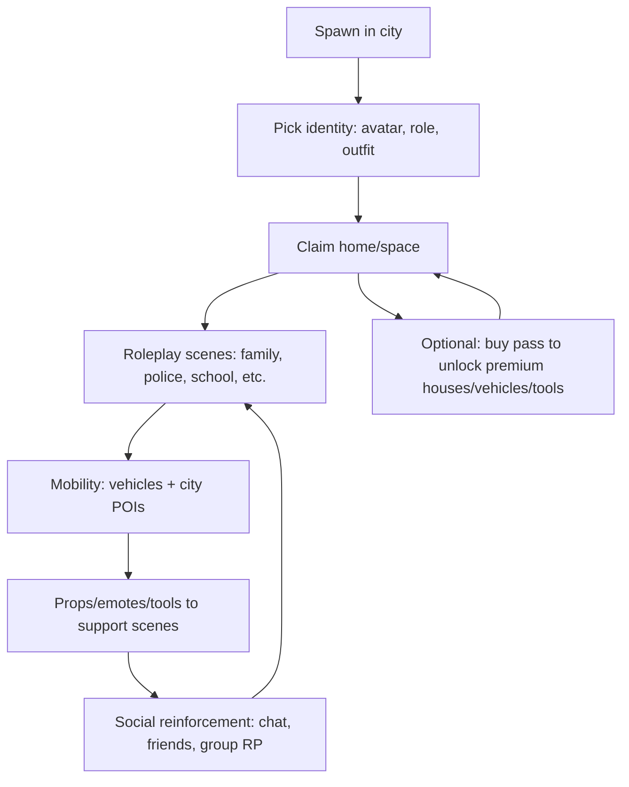
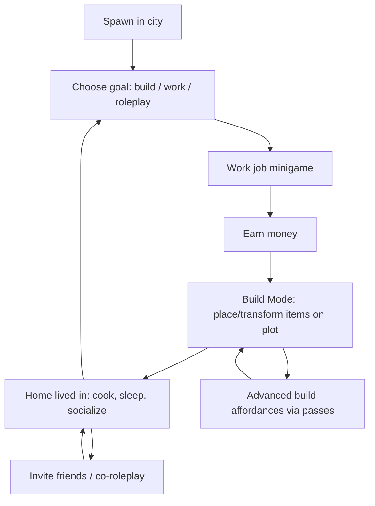
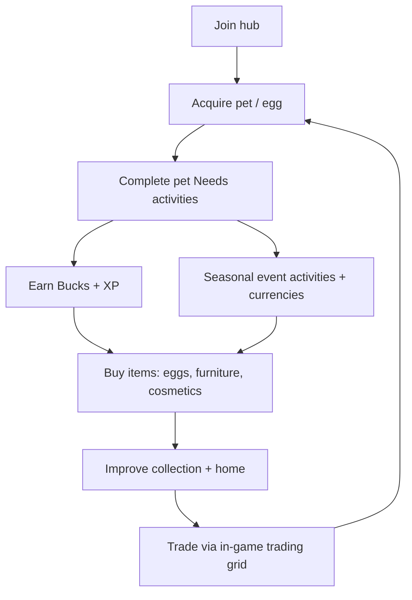
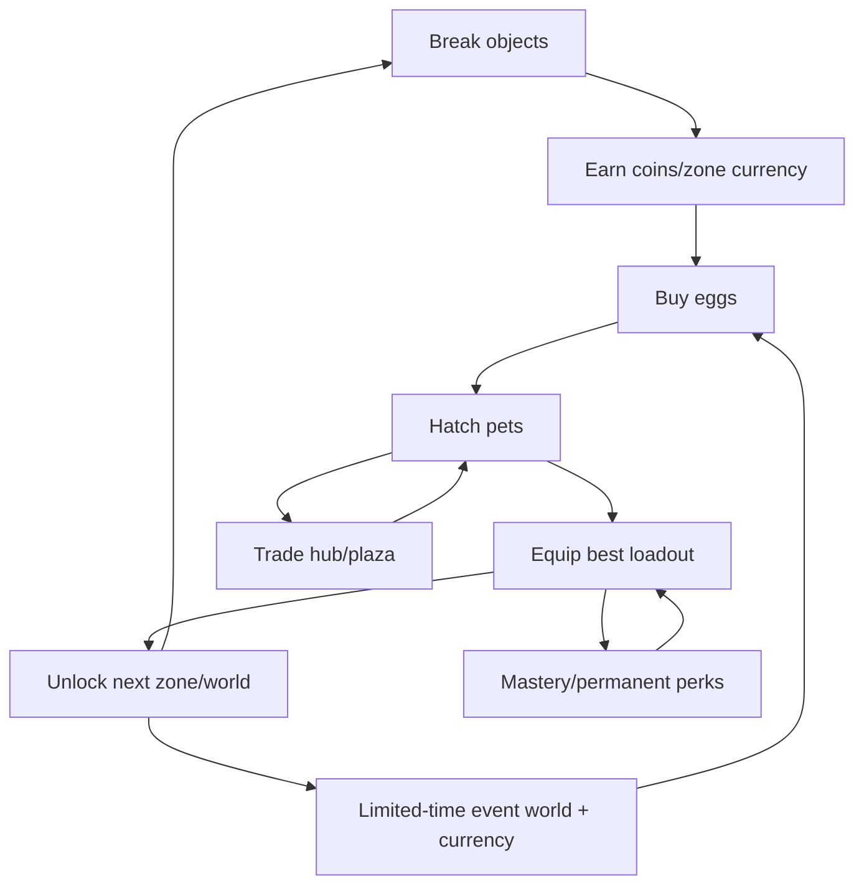
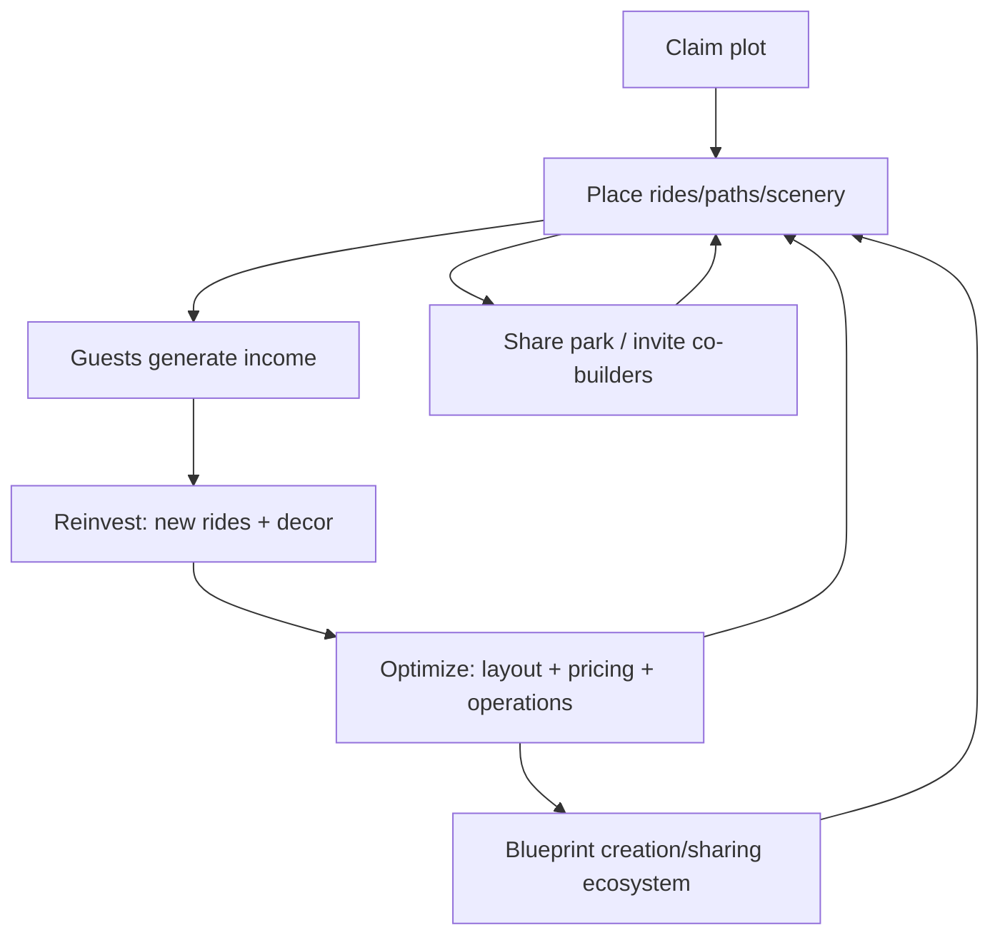
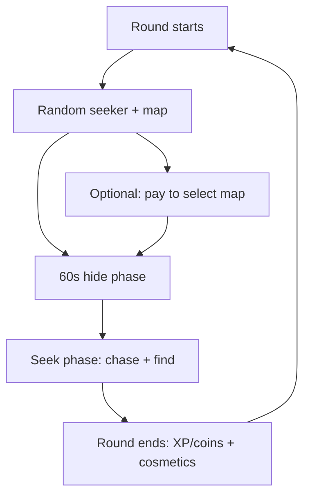
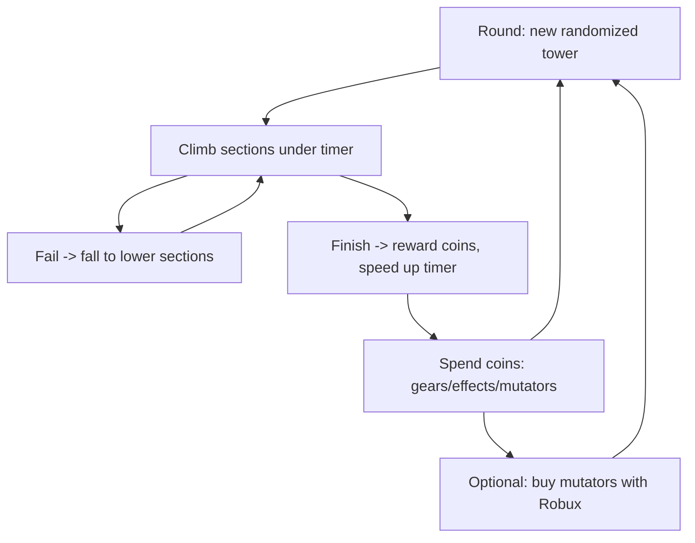
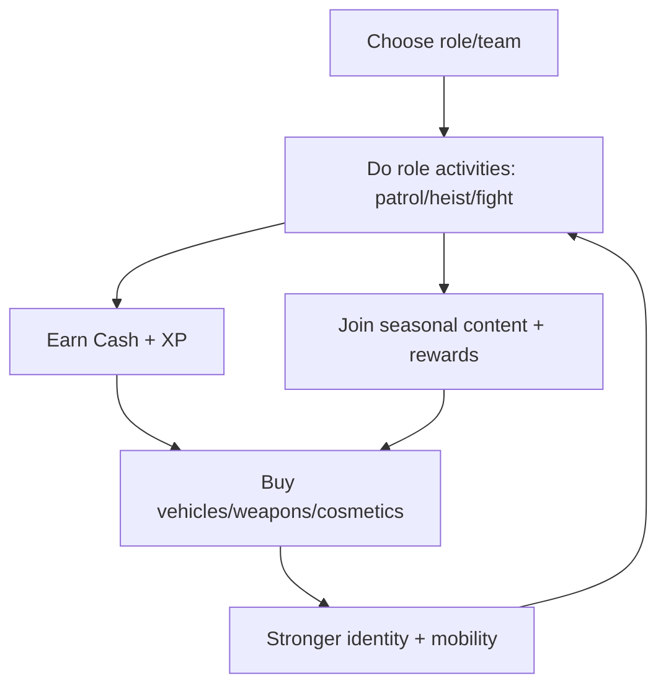
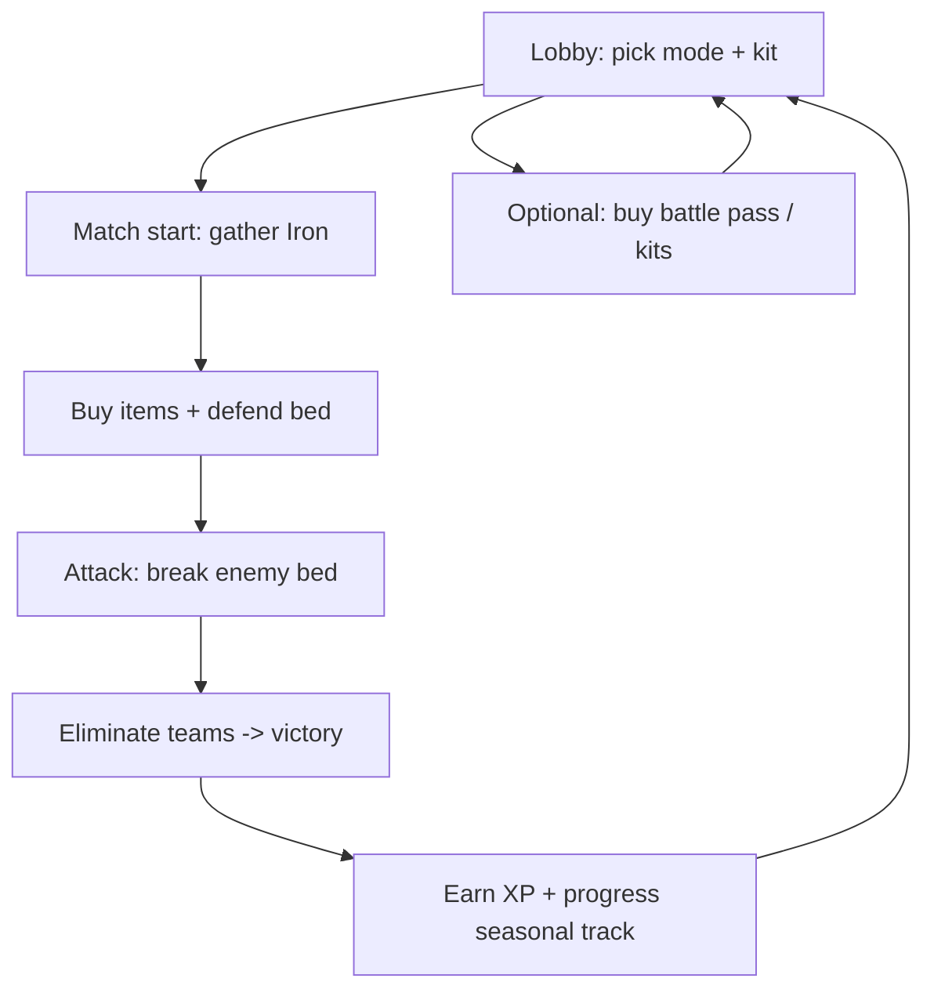
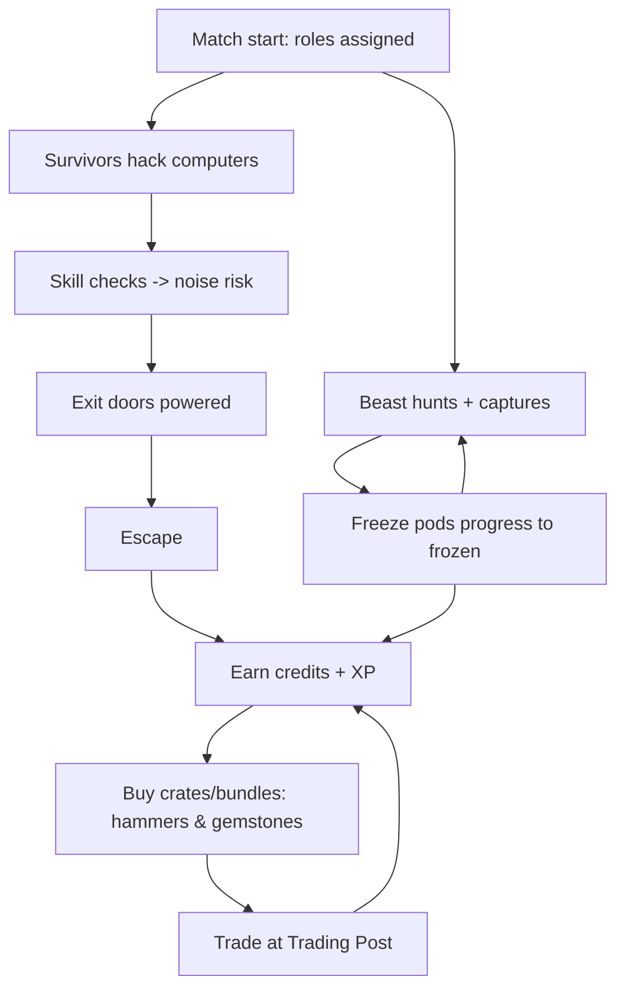

# Reverse-Engineering Design Patterns in Ten Hit Roblox Experiences

## Executive summary

This report decomposes ten high-performing Roblox experiences into implementable design specs for experienced game developers. Evidence is prioritized toward primary sources: official Roblox experience descriptions, official studio sites and developer blogs, and official support / patch-note style posts; community wikis and forums are used only when primary sources do not specify a detail (and are explicitly labeled as such). citeturn12search13turn8view1turn17view0turn20search1turn11view0

Across these titles, three macro-patterns dominate success:

1. **“Social-first” loops that create player-generated stories**: roleplay sandboxes (Brookhaven RP; Welcome to Bloxburg), pet-raising/trading sims (Adopt Me!; Pet Simulator X), and creative tycoons (Theme Park Tycoon 2) all let social interaction generate content, not just consume it. This is directly stated for Brookhaven (hang out, roleplay, houses/vehicles/city) and for Bloxburg (build, work, relax/social). citeturn12search13turn8view1turn10view0turn8view2

2. **Progression is usually “horizontal breadth” rather than pure skill rating**: players chase *collection breadth* (pets, cosmetics, build catalog) and *creative mastery* (build tools, blueprint sharing, advanced building toggles), while competitive titles use modular “loadout identity” (kits/classes) and seasonal structures. citeturn17search27turn20search16turn23search8turn11view0

3. **Live-ops and novelty injection are structural, not cosmetic**: weekly/seasonal cadence (explicit for BedWars) and time-limited events/currencies (explicit for Adopt Me and Pet Simulator X) drive reactivation and “fear of missing out,” while still preserving a stable base loop. citeturn2search8turn17search23turn20search1

Implementation takeaway: if you want “Roblox-scale” longevity, design for (a) **low-friction onboarding**, (b) **repeatable, short feedback loops**, (c) **a durable meta-loop** (collection, building mastery, competitive rank), and (d) **a live-ops content pipeline** that can ship safely under concurrency—supported by robust persistence and anti-exploit validation. Roblox platform primitives for monetization, chat, analytics, persistence, and streaming matter and should be planned from day one. citeturn5search0turn5search6turn6search2turn6search3turn6search0

## Comparative matrix and genre archetypes

**Archetype clustering (design intent)**

- **Social life-sim / RP sandbox**: Brookhaven RP; Welcome to Bloxburg. citeturn12search13turn8view1turn10view0turn8view2  
- **Collect–upgrade–trade economy sim**: Adopt Me!; Pet Simulator X. citeturn3search0turn7view0turn20search1turn20search16  
- **Creative builder tycoon**: Theme Park Tycoon 2. citeturn11view0turn1search9  
- **Round-based social minigame**: Hide and Seek Extreme. citeturn1search0turn14search27  
- **Skill obby with optional “rule-bending” economy**: Tower of Hell. citeturn12search6turn25search4turn25search16  
- **Open-world cops vs criminals fantasy**: Mad City. citeturn13search8turn13search1turn13search15  
- **Session-based competitive PvP w/ seasons**: BedWars. citeturn2search8turn23search0turn23search8  
- **Asymmetrical multiplayer horror**: Flee the Facility. citeturn2search5turn24search15turn26search3  

**Cross-game comparison (mechanics + economy + monetization)**  
*(“Unspecified” means not stated in primary sources surfaced in this research; community sources may suggest details and are labeled.)*

| Title | Session model | Primary progression axis | Key currencies (soft / premium / event) | Main monetization surfaces | Signature social moat |
|---|---|---|---|---|---|
| Brookhaven RP | Persistent RP map citeturn12search13turn8view2 | Cosmetic + access breadth (houses/vehicles/tools) | Soft: **Unspecified**; Premium: Robux (game passes) citeturn12search17turn25search39 | One-time game passes (e.g., premium/VIP-style access) citeturn12search17turn25search39 | “Hang out + roleplay” story-making citeturn12search13turn8view2 |
| Welcome to Bloxburg | Persistent city + per-player plot citeturn10view0turn8view1 | Building mastery + wealth + lifestyle | Soft: in-game money from jobs citeturn10view0turn8view1 / Premium: Robux (game passes) (community) citeturn26search1 / Event: unspecified | Game passes for build affordances (community) citeturn26search1 | Co-play / co-building + roleplay communities citeturn10view0turn8view1 |
| Adopt Me! | Persistent hub + instanced homes citeturn7view0turn3search0 | Pet collection + pet care progression + trading status | Soft: Bucks (earning + sinks) citeturn17search23turn17search9 / Premium: Robux / Event: seasonal currencies (e.g., event notes) citeturn17search23turn17search27 | Premium items + safety-gated trading ecosystem (primary: trade grid/license) citeturn17search0turn17search9 | Trading + identity display citeturn3search0turn17search0 |
| Pet Simulator X | Zone/world progression citeturn20search3turn20search1 | Power scaling + collection rarity + mastery | Soft: coins/zone currencies (implied) / Premium: Robux / Event: Candy, Gingerbread, etc. citeturn20search17turn20search8turn20search1 | Boosts + merch code tie-ins + premium purchases citeturn20search16turn8view0 | Trading + collectible prestige citeturn20search19turn20search1 |
| Theme Park Tycoon 2 | Persistent plot per player citeturn1search9turn11view0 | Park value + build complexity + blueprint ecosystem | Soft: money from guests (community); Rare: “Credits” (community) citeturn16search4 / Premium: Robux (passes/currency) (community) citeturn26search4turn16search6 | Building affordance game passes (disable collisions, height, operations) (community) citeturn16search6turn26search16 | Sharing parks/blueprints + co-building citeturn11view0turn16search13 |
| Hide and Seek Extreme | Rounds on selected map citeturn14search27turn1search0 | Cosmetic collection + map knowledge | Soft: coins collectible on maps (community) citeturn14search3 / Premium: Robux map selection (community) citeturn14search27 | Pay-for-map-select convenience (community) citeturn14search27 | Party laughter + shared “gotcha” moments citeturn1search0turn14search11 |
| Tower of Hell | 8-min rounds, randomized tower (community) citeturn12search6 | Skill mastery + cosmetics + coin income | Soft: Coins citeturn25search4 / Premium: Robux mutators/effects (community) citeturn25search16turn26search6 | Mutators / rule-bending purchases + cosmetics lootboxes (community) citeturn25search16turn26search6 | Spectating/competition in same server citeturn12search6turn25search4 |
| Mad City | Open-world roles + activities citeturn13search8turn13search15 | Cash + XP + vehicles/weapons | Soft: Cash (community) citeturn13search1 / Premium: Robux (cash/passes) (community) citeturn13search1turn13search15 / Event: seasonal | VIP/XP boosts implied (community) citeturn13search15turn13search1 | Role identity (hero/villain/police/criminal) citeturn13search8turn13search15 |
| BedWars | Instanced matches + lobby meta citeturn2search8turn4search2 | Seasonal kits + cosmetics + rank | Match: Iron/Diamonds/Emeralds (community) citeturn4search2 / Meta: BedCoins + Robux (community) citeturn23search8 | Battle pass + kits sales/rotation (community) citeturn23search0turn23search8 | Parties/clans + teamwork identity citeturn2search8turn23search0 |
| Flee the Facility | Match-based asymm horror citeturn2search5turn24search31 | XP levels + cosmetics + trade inventory | Soft: Credits citeturn25search1 / Premium: Robux bundles (community) citeturn25search5 / Event: seasonal bundles citeturn25search5 | Crates/bundles and event cosmetics (community) citeturn25search1turn25search5 | Dedicated Trading Post economy citeturn26search3turn25search1 |

## Game design dossiers

Below, each title is expressed as a **developer-implementable spec**, with explicit notes on what is **unspecified** by primary sources.

---

**Brookhaven RP**

Primary framing: the official description positions it as a roleplay hangout with houses/vehicles/city exploration, and a later acquisition press release reiterates roleplay + “live in big houses, drive vehicles, explore the city.” citeturn12search13turn8view2  
Ownership context: entity["company","Voldex","roblox ugc studio"] acquired Brookhaven from creator entity["people","Wolfpaq","roblox creator"] (announced Feb 2025). citeturn8view2turn3search4turn3search17

Core loop + progression + social flow (high-level; many internal items are not specified in primary sources): citeturn12search13turn8view2turn12search17

1. 🎮 **Core loop(s)**: *Identity setup → choose location (home/POI) → social story-making → move between POIs with vehicles → repeat with new roles/scenes.* The “content” is the emergent narrative, not scripted quests. citeturn12search13turn8view2  
2. 👥 **Player types & motivations**: socializers/role-players; decorators (home choice + micro-customization); explorers (secret/novel POIs); “status” players via premium access & cosmetics. (Exploration/status are inferred; official sources emphasize RP + houses/vehicles.) citeturn12search13turn8view2  
3. 🧭 **Onboarding & retention**: minimal tutorial; immediate “what do you want to be?” prompt. Retention via frequent novelty (new props/POIs), social commitment (friend groups), and aspirational access (premium houses/vehicles). Premium pass describes access to premium houses/vehicles and unique chat color. citeturn12search17turn8view2  
4. 📈 **Progression & pacing**: mostly horizontal unlocks (new house models, vehicles, props); no explicit skill ladder in primary sources (unspecified). citeturn12search13  
5. 💰 **Economy (currencies, sinks, balancing)**: soft currency is **unspecified** in primary sources. Monetization is clearly pass-driven; e.g., “Premium” pass grants access to premium houses/vehicles/helicopter/jet and unique chat color. citeturn12search17  
6. 🤝 **Social systems**: core chat-based RP; soft coordination via friend groups. (Formal parties/clans/trading are **unspecified** in primary sources.) citeturn12search13turn8view2  
7. 🗺️ **Space design & interaction points**: compact city with high-density POIs that map cleanly to RP archetypes (homes, civic buildings, schools/shops/“scene” spots). The acquisition release explicitly calls out city exploration + houses+vehicles as central. citeturn8view2turn12search13  
8. 🎛️ **Controls/camera/UI patterns**: third-person avatar default; fast “spawn vehicle / switch house / emote/prop” interaction model (specific UI is **unspecified** in primary sources).  
9. 🧱 **Technical considerations**:  
   - **Streaming + performance**: large RP maps benefit from instance streaming for memory/perf. citeturn6search2  
   - **Persistence**: store per-user entitlements (passes), preferred home, cosmetic loadout; use DataStore budgets defensively. citeturn5search0  
   - **Exploit surface**: remote validation for vehicle spawning, tool usage, property claims. citeturn6search1  
10. 📊 **Recommended metrics**: session length, % players who join/return with friends, “roleplay start” proxies (emote usage, prop spawn, vehicle spawn), premium conversion, and new POI engagement after updates. (Instrument using Roblox analytics funnels/retention dashboards.) citeturn6search0turn6search4  
11. 🌐 **Accessibility/localization**: text chat must be filtered and privacy-aligned; rely on TextChatService defaults and guidelines. citeturn6search3turn6search15  
12. ✅ **Implementation checklist & roadmap**  
   - **P0 (MVP)**: avatar + emotes; property claim; vehicle spawn & driving; 8–12 RP POIs; prop/tool wheel; safe chat defaults.  
   - **P1**: premium entitlements; POI “mini-interactions” (doors, seats, simple jobs); server moderation hooks.  
   - **P2**: seasonal map themes; limited-time props; creator tools for RP events.  
   - **Roadmap**: (1) MVP (4–8 weeks), (2) entitlement + content cadence (8–12 weeks), (3) live-ops platform + analytics iteration (ongoing).  
   - **Pitfalls**: over-large map without streaming; client-authoritative spawning; content spam without moderation/limits.

---

**Welcome to Bloxburg**

Primary framing: it is explicitly described as a life-sim sandbox in which players build/customize houses, take jobs, earn currency, and roleplay in a persistent online city. citeturn10view0turn8view1  
Studio context: part of entity["company","Coffee Stain Group AB","games group sweden"] per its own site, and linked to entity["company","Embracer Group AB","video game holding company"] disclosures. citeturn8view1turn10view0  
Creator identity appears in community documentation (not primary): entity["people","Coeptus","roblox developer"]. citeturn26search13

1. 🎮 **Core loop(s)**: *Work → earn → build/upgrade home (and optionally businesses) → roleplay lifestyle → repeat.* Coffee Stain’s feature list makes this explicit (“Build!”, “Work!”, “Relax!”). citeturn8view1turn10view0  
2. 👥 **Player types**: builders (architectural creativity), “life-sim optimizers” (money/hour, bill management), social roleplayers (families, hangouts). This aligns with Bloxburg being framed as creativity + social interaction in Embracer’s description. citeturn10view0  
3. 🧭 **Onboarding & retention**:  
   - Onboarding is usually “starter house → first job → first furniture purchases” (starter houses and build mode described in community material; not fully specified in primary). citeturn24search1  
   - Retention: long-term building goals, expanding skills/jobs, and social routines; an Embracer document emphasizes long-term engagement via creativity/social interaction. citeturn10view0  
4. 📈 **Progression & pacing**: wealth progression gates build scope; build mastery gates aesthetic sophistication. “Work” is the primary earning method; community documentation notes pay depends on work experience/efficiency/mood (community source). citeturn24search29turn25search10  
5. 💰 **Economy & monetization**:  
   - Soft currency: in-game money from jobs. citeturn10view0turn8view1  
   - Monetization: build-affordance game passes (e.g., Advanced Placing, Multiple Floors, Basements, Large Plot) documented by the community wiki; not specified in the primary sources above. citeturn26search1turn26search13  
   - Sinks: home items, expansion, bills (bills referenced in community descriptions; not primary). citeturn26search1  
6. 🤝 **Social systems**: roleplay; visiting friends’ plots; co-building is community-documented in builder ecosystems (not primary). Embracer explicitly highlights communities and personal stories. citeturn10view0turn8view1  
7. 🗺️ **Space design**: a town hub + parcelized private plots. Key interaction points: job locations (pizza delivery, etc.), shopping/build catalog points, home mailbox entry to build mode (community). citeturn24search1turn8view1  
8. 🎛️ **Controls/camera/UI**: heavy UI for build catalog, placement, transform; biggest friction is mobile build ergonomics (community feedback). citeturn24search21turn24search13  
9. 🧱 **Technical considerations**:  
   - **High-frequency replication** of building edits (place/move/delete) must be rate-limited and server validated. citeturn6search1turn6search17  
   - **Persistence size**: large builds risk datastore payload limits; split save data (structure vs deco), compress, and use incremental saves. (Roblox budgets/limits are surfaced in DataStore docs; exact Bloxburg limits are unspecified.) citeturn5search0turn6search17  
10. 📊 **Recommended metrics**: “first build success” funnel (place ≥10 items), first job completion, money earned in first session, build-mode minutes, return rate after 24h/7d, % co-play sessions. citeturn6search0turn6search4  
11. 🌐 **Accessibility/localization**: localization can materially expand playtime; entity["people","Den_S","roblox developer"] reported 1000+ strings and a major impact of Spanish localization (Spanish audience doubled and playtime increased). citeturn11view0  
12. ✅ **Implementation checklist & roadmap**  
   - **P0**: plot ownership + enter/exit build mode; 200–400 build items; 3–5 jobs; simple needs/bills loop.  
   - **P1**: advanced placement affordances; multi-save slots; co-build permissions; robust save pipeline.  
   - **P2**: seasonal city revamps; creator events; furniture/recipe expansions in monthly drops.  
   - **Pitfalls**: save bloating; UI overload on mobile; pay inflation breaking build pacing.

---

**Adopt Me!**

Primary framing: official site emphasizes raising pets, making friends, and building homes; Roblox experience copy emphasizes collecting pets and trading with friends. citeturn7view0turn3search0  
Safety + economy governance are unusually well-documented by the studio via support posts.

1. 🎮 **Core loop(s)**: *Adopt/obtain pet → satisfy Needs (mini-activities) → earn Bucks/XP → spend on eggs/items → trade to optimize collection.* Official “Active Needs Notes” explicitly describes Needs activities that reward Bucks and XP. citeturn17search23turn17search27turn3search0  
2. 👥 **Player types**: collectors (rarity ladder), traders (market play), caretakers (routine comfort), decorators (homes), socializers. This matches official framing: raise pets + make pals + build home. citeturn7view0  
3. 🧭 **Onboarding & retention**:  
   - Onboarding: early pet acquisition + first Needs; then introduction to home building and trading (exact tutorial flow unspecified).  
   - Retention: time-limited events and new activities; “Pet Needs Revamp” indicates iteration on interaction UX by tapping pet for tricks/needs UI. citeturn17search27turn7view0  
4. 📈 **Progression & pacing**: collection depth (pets, wear, vehicles), plus “Needs” refresh is a pacing lever (new activities keep routine from going stale). citeturn17search23turn17search27  
5. 💰 **Economy & monetization (with strong anti-scam constraints)**:  
   - **Bucks transfer is restricted**; studio warns that “bucks for pets” trades are not supported and likely scams, with small transfer limits on registers/stands and a desire (as of 2020) to add Bucks trading in future. citeturn17search9turn17search0  
   - Trading safety relies on the **in-game trading grid** and **Trade License** tooling; support explicitly advises reporting scams via Trade License. citeturn17search0turn17search3  
6. 🤝 **Social systems**: chat + social hub; trading is a first-class system with governance (licenses/history). citeturn17search0turn3search0  
7. 🗺️ **Space design**: central “Adoption Island” hub + private homes. Key interaction points: Nursery/egg acquisition, event locations, home build-with-friends feature implied by site copy (“build with friends”). citeturn7view0  
8. 🎛️ **Controls/camera/UI**: pet interaction window revamp (“tap on your pet…interaction window”). citeturn17search27  
9. 🧱 **Technical considerations**:  
   - **Trade integrity** is the #1 engineering risk: server-authoritative trade state, immutable audit log, exploit-resistant inventory. The studio’s emphasis on “trading grid” implies strict internal validation. citeturn17search0turn17search9  
   - **Scam detection UX**: provide double-confirmation screens and late-change prevention (explicitly referenced in scam guidance). citeturn17search0  
10. 📊 **Recommended metrics**: Needs completion rate, Bucks/XP earned per minute, egg purchases, trade attempts → completed trades, trade reports filed, % users encountering “unfair trade” warnings (if implemented), and event reactivation lift. citeturn6search0turn6search10turn17search23  
11. 🌐 **Accessibility/localization**: heavy UI text should use localization tables / auto translation; Roblox provides automatic translation tooling. citeturn5search2turn5search5  
12. ✅ **Implementation checklist & roadmap**  
   - **P0**: pets + Needs loop; soft currency + sinks; home editing; safe trade MVP (grid + confirm + log).  
   - **P1**: event pipeline (limited currencies, quest UI); anti-scam reporting UX.  
   - **P2**: advanced market features (price history, “fairness” hints) + UGC cosmetic integrations.  
   - **Pitfalls**: off-grid trading vectors; inventory dupes; economy inflation without sinks.

---

**Pet Simulator X**

Primary evidence is unusually strong via the official entity["company","BIG Games","roblox studio brand"] developer blog category for Pet Simulator X (2021–2023), which documents world gating, limited-time event currencies, mastery, quests, and merch code tie-ins. citeturn20search0turn20search1turn20search16turn8view0

1. 🎮 **Core loop(s)**: incremental “break → earn → hatch → scale power → unlock zones,” with periodic event worlds. Doodle World and Halloween posts explicitly describe gated worlds accessed by portals/cannons and limited-time areas. citeturn20search3turn20search17turn20search1  
2. 👥 **Player types**: grinders (efficiency), collectors (rarity), traders (marketplay), completionists (quests/mastery), and “status” whales (exclusive/huge pets). citeturn20search16turn20search19turn20search1  
3. 🧭 **Onboarding & retention**: onboarding is implicit: first egg is the tutorial. Retention is driven by frequent content drops (developer blog cadence) and limited-time currencies/eggs (Candy, Gingerbread, etc.). citeturn20search17turn20search8turn20search1  
4. 📈 **Progression & pacing**:  
   - Zone unlock gates tune pacing; events offer alternate progression tracks (“Hardcore Candy,” upgrades that persist after event for some cases). citeturn20search1turn20search17  
   - “Mastery” adds long-term permanent perks. citeturn20search16  
5. 💰 **Economy & monetization**:  
   - Event currencies are explicit (Candy, Gingerbread, Clover Coin). citeturn20search17turn20search8turn20search25  
   - Merch tie-in: plush drops include exclusive redeem codes for “Huge” pets. citeturn20search16  
   - Studio site also pushes “in-game merch” (Titanics) and DLC-style rewards. citeturn8view0  
6. 🤝 **Social systems**: trading is built into progression (developer blog explicitly references a “Trading Plaza Terminal” in an update). citeturn20search0turn20search19  
7. 🗺️ **Space design**: hub town + portal/cannon entry to worlds; event areas are accessed through world-specific entry points (e.g., spooky house, cannon). citeturn20search1turn20search22turn20search17  
8. 🎛️ **Controls/UI**: inventory management, auto-delete indicators, teleport menu fixes show that UI friction at scale is a major concern. citeturn20search5  
9. 🧱 **Technical considerations**:  
   - **High-volume inventories** demand robust serialization and server validation (duplication risk).  
   - **Event content** should be flag-driven and rollback-safe (one config toggles currency spawns, portal access, loot tables).  
   - **Performance**: dev blog acknowledges disabling a feature (“MagicText”) to improve performance. citeturn20search5  
10. 📊 **Recommended metrics**: currency inflow/outflow per zone, hatch rate and sink efficiency, event participation, trade volume, % users reaching each world, conversion per update drop. citeturn6search10turn6search0turn20search1  
11. 🌐 **Accessibility/localization**: auto-translate UI + store text; ensure number formatting/localized pluralization. citeturn5search2turn5search7  
12. ✅ **Implementation checklist & roadmap**  
   - **P0**: breakables + currencies + eggs + pet equip; zone gates; basic trading.  
   - **P1**: mastery/perks; event framework (limited currency + upgrades); analytics-driven balancing.  
   - **P2**: merch/DLC redemption system; anti-duplication hardening; scalable content authoring pipeline.  
   - **Pitfalls**: currency inflation; inventory dupes; “power creep” invalidating older content.

---

**Theme Park Tycoon 2**

Primary framing: official Roblox Developer Relations spotlight describes why it succeeded—*creative game + social experience* with depth for advanced builders—and provides concrete localization lessons (1000+ strings; Spanish audience doubled). citeturn11view0

1. 🎮 **Core loop(s)**: *Build park → earn from guests → reinvest → optimize → share.* Spotlight explicitly frames it as creative + social with advanced build options. citeturn11view0  
2. 👥 **Player types**: builders/creators, optimizers (park efficiency), social showcase players (rating parks). citeturn11view0turn16search13  
3. 🧭 **Onboarding & retention**: onboarding through simple starter rides; retention through ever more sophisticated builds and social showcase loops. The existence of a blueprint marketplace indicates long tail creator culture (unofficial but relevant). citeturn16search13turn11view0  
4. 📈 **Progression & pacing**: park expansion and ride catalog expansion. Community sources document a rare currency “Credits” earned via missions/achievements and used for plots/skins (community). citeturn16search4  
5. 💰 **Economy & monetization**: community documentation emphasizes game passes that expand building affordances (disable collisions; increased height; ride operations; expansion plots). citeturn16search6turn26search16turn26search31  
6. 🤝 **Social systems**: co-building permissions and sharing. The spotlight highlights building and experiencing parks with friends as key. citeturn11view0turn16search17  
7. 🗺️ **Level/space design**: per-player plots with hard boundaries; modular build grid enables predictable saves and replication. Expansion is a key interaction point (community: plot expansions). citeturn26search31  
8. 🎛️ **Controls/UI**: builder UI must support fast selection, transform, grid snap; “disable collisions” introduces advanced snapping/rotation options (community). citeturn16search6  
9. 🧱 **Technical considerations**:  
   - **Persistence**: large parks risk save-size errors; design with chunking + LOD data (common Roblox perf guidance). citeturn6search17turn5search0  
   - **Co-build concurrency**: enforce plot “locks” and conflict resolution (server authority). citeturn6search1  
10. 📊 **Recommended metrics**: builder time per session, save size growth, % users reaching expansion milestones, blueprint use (import/export), park visit rate from friends. citeturn6search0turn6search8  
11. 🌐 **Accessibility/localization**: localization impact is explicitly documented (1000 unique strings; Spanish audience doubled, playtime increased). citeturn11view0  
12. ✅ **Implementation checklist & roadmap**  
   - **P0**: stable builder core (paths/rides/scenery), simple guest sim, saving.  
   - **P1**: “advanced building” game passes/features; blueprint sharing; co-build permissions.  
   - **P2**: missions + rare currency; seasonal decoration sets; creator spotlight UGC.  
   - **Pitfalls**: runaway save sizes; physics-heavy rides on mobile; griefing in co-build.

---

**Hide and Seek Extreme**

Primary framing: round-based hide-and-seek; community documentation provides concrete design knobs like map selection for a small Robux fee and a fixed hide timer. citeturn1search0turn14search27

1. 🎮 **Core loop(s)**: classic hide timer → seek timer → results → repeat, with map variety as the main freshness lever. citeturn14search27turn1search0  
2. 👥 **Player types**: socializers, chaos players, map-knowledge optimizers (best hiding spots). citeturn14search15turn14search11  
3. 🧭 **Onboarding & retention**: near-zero onboarding; the rules are culturally known. Retention is in skillful map exploration and cosmetic goals (coins appear as collectibles on maps in community descriptions). citeturn14search3turn14search27  
4. 📈 **Progression & pacing**: mostly cosmetic; “coins found along the way” suggests a lightweight meta-economy. citeturn14search3  
5. 💰 **Economy/monetization**: map selection for 6 Robux is documented by community sources; other monetization is unspecified in primary sources. citeturn14search27  
6. 🤝 **Social systems**: chat reactions, informal parties; hard social features are unspecified in primary sources. citeturn1search0  
7. 🗺️ **Level design**: maps are “toy-scale” environments (bedroom/store/kitchen etc) with verticality and secret pockets (community map docs). citeturn14search3  
8. 🎛️ **Controls/UI**: default movement; success depends on camera manipulation and spatial awareness.  
9. 🧱 **Technical considerations**: low persistence demands; focus on anti-exploit for speed/jump hacks and round-state integrity. citeturn6search1turn6search17  
10. 📊 **Recommended metrics**: round completion rate, seeker win rate vs hider win rate, map-specific churn, coin pickup rate, average rounds/session. citeturn6search0turn6search4  
11. 🌐 **Accessibility/localization**: super light text; still ensure chat filtering. citeturn6search3  
12. ✅ **Implementation checklist & roadmap**:  
   - **P0**: solid round controller, 6–8 maps, hide timer UI, seeker tagging.  
   - **P1**: cosmetics store + soft currency; anti-cheat pass.  
   - **P2**: weekly map rotation + limited cosmetics.  
   - **Pitfalls**: map exploits (out-of-bounds); seeker frustration from poor nav.

---

**Tower of Hell**

Community documentation is rich about macro-loop: randomized tower that resets every eight minutes and no checkpoints (unless purchased via mutator), plus robust coin economy (coins buy gears/mutators/effects). citeturn12search6turn25search4turn25search16turn26search6  
Developer credit (community): entity["organization","YXceptional Studios","roblox dev group"]. citeturn12search6

1. 🎮 **Core loop(s)**: “attempt climb → fail → retry within same round → earn partial rewards → spend on cosmetics/advantages → repeat.” Objective and timer reset are community-documented. citeturn12search6turn25search4  
2. 👥 **Player types**: skill purists (no checkpoints), speedrunners, social competitors, cosmetic collectors. citeturn12search6turn25search4  
3. 🧭 **Onboarding & retention**: onboarding is the tower itself; retention via coin drip and “almost made it” frustration-reward. Critically, coins can be earned even without completing the whole tower (community). citeturn25search4  
4. 📈 **Progression & pacing**: short rounds and randomized sections prevent rote memorization; partial reward formula and no checkpoint baseline increase “run count.” citeturn25search4  
5. 💰 **Economy & monetization**: coins are main currency; coins buy gears/mutators/effects, and some mutators are explicitly Robux-priced (invisibility, checkpoints, etc.) in community docs. citeturn25search4turn25search16turn26search6  
6. 🤝 **Social systems**: emergent competition and spectate; mutators are server-wide (community). citeturn12search0turn25search16  
7. 🗺️ **Level design**: modular “section library” assembled into towers; difficulty gradients via section ordering.  
8. 🎛️ **Controls/UI**: tight platforming; UI needs timer + vertical progress + coin meter (coins sidebar mentioned in community). citeturn25search4  
9. 🧱 **Technical considerations**: deterministic tower assembly per round; exploit detection for speed/jump/fly; server authority for mutators and coin awards. citeturn6search1turn6search17  
10. 📊 **Recommended metrics**: section completion distribution, fall causes (kill-part vs miss), coins earned per minute, mutator purchase rate, completion rate per skill cohort. citeturn6search0turn6search10  
11. 🌐 **Accessibility/localization**: minimal text; still localize UI strings; ensure contrast in “negative/fog” mutators doesn’t break readability (design requirement; mutators listed). citeturn25search16turn5search5  
12. ✅ **Implementation checklist & roadmap**  
   - **P0**: section library + random assembly, timer, basic rewards.  
   - **P1**: gear/effects shop + server-wide mutators.  
   - **P2**: curated seasonal sections, anti-exploit tuning, skill-based matchmaking (optional).  
   - **Pitfalls**: pay-to-win perception if checkpoints dominate; desync in kill-part validation.

---

**Mad City**

Primary framing: “YOU write the story… become a hero or villain… unleash mayhem or keep the peace.” citeturn13search8  
Economy + heists loop details are largely from community wikis (explicitly labeled as such).

1. 🎮 **Core loop(s)**: role selection (hero/villain) → activities (combat/heists) → cash/xp → upgrades. Role fantasy is primary-source; cash/heist details are community. citeturn13search8turn13search1turn13search15  
2. 👥 **Player types**: PvP hunters, grinders, collectors of vehicles/skins, social squads. citeturn13search15turn13search13  
3. 🧭 **Onboarding & retention**: role choice is onboarding; retention via expanding heist catalog and seasonal “chapter” updates (community). citeturn13search5  
4. 📈 **Progression & pacing**: cash and XP unlock persistent vehicles/weapons; wallet/heist stacking mechanics are community-documented. citeturn13search20turn13search1  
5. 💰 **Economy/monetization**: community indicates cash can be bought via Robux in phone menu and used to buy vehicles/weapons; VIP/Double XP passes exist (community). citeturn13search1turn13search15  
6. 🤝 **Social systems**: emergent teams, group play in heists, PvP rivalries; formal systems unspecified in primary.  
7. 🗺️ **Space design**: a city map with “heist nodes” that open/close; status indicator for heist open/closed is community-described. citeturn13search15  
8. 🎛️ **Controls/UI**: vehicle driving + combat; phone UI for purchases/loadout (community). citeturn13search1  
9. 🧱 **Technical considerations**:  
   - **Server-authoritative combat** and arrest/loot payout; anti-teleport/fly is critical. citeturn6search1turn6search17  
   - **Persistent ownership** of vehicles/weapons must be secure. citeturn5search0  
10. 📊 **Recommended metrics**: role distribution, heist completion rate/time, PvP kill:death by role, cash inflation, vehicle purchase funnel. citeturn6search0turn6search10  
11. 🌐 **Accessibility/localization**: localization for UI-heavy phone menus; auto-translate baseline. citeturn5search2  
12. ✅ **Implementation checklist & roadmap**  
   - **P0**: 2–3 roles, 3 heists, basic combat + vehicles, simple shop.  
   - **P1**: seasonal progression track + rewards; anti-exploit.  
   - **P2**: more heists + bosses + UGC collabs.  
   - **Pitfalls**: grind walls encouraging pay-to-win; cheaters breaking PvP trust.

---

**BedWars**

Primary framing: protect your bed, play multiple modes, and updates are scheduled weekly in the Roblox description snippet. citeturn2search8turn2search12  
Meta-progression details (kits, BedCoins, battle pass price) are mainly from community documentation and are labeled as such.

1. 🎮 **Core loop(s)**: session PvP loop: gather resources → upgrade → defend/attack → win; supported by multi-mode playlists. citeturn2search12turn4search2  
2. 👥 **Player types**: competitive team players; “kit mains” (identity); social squads; builders/strategists. citeturn4search3turn23search8  
3. 🧭 **Onboarding & retention**: low friction: join lobby, press play; retention via weekly updates (primary), plus seasonal reward structures (community). citeturn2search8turn23search0  
4. 📈 **Progression & pacing**: match-based skill learning and meta progression through kits/battle pass (community). citeturn23search8turn23search0  
5. 💰 **Economy**:  
   - Match currencies (Iron/Diamonds/Emeralds) are community-documented. citeturn4search2  
   - Battle pass monetization (799 Robux) + 20% XP bonus is community-documented. citeturn23search0turn4search15  
6. 🤝 **Social systems**: party/teamplay; clans implied by battle pass XP bonuses in community docs (not primary). citeturn23search0  
7. 🗺️ **Level design**: symmetrical arenas with well-known lanes (base–mid–diamond/emerald gen).  
8. 🎛️ **Controls/UI**: fast hotbar inventory; shop UI; ping systems exist in patch notes (community). citeturn21search0  
9. 🧱 **Technical considerations**: highest anti-cheat demands among the set: hit validation, speed, reach, fly, autoclick; server authority for item purchases and resource ticks. citeturn6search1turn6search17  
10. 📊 **Recommended metrics**: matchmaking fairness (winrate by MMR), kit pick rate vs win rate, churn after balance patches, crash rate under concurrency, weekly update reactivation. citeturn6search4turn6search0  
11. 🌐 **Accessibility/localization**: keybind parity on mobile/console is important; patch notes mention PC-only features being expanded (community). citeturn21search0  
12. ✅ **Implementation checklist & roadmap**  
   - **P0**: 1–2 core modes, tight combat, resource gen, bed destruction win condition.  
   - **P1**: seasonal track + missions; kit system; weekly content cadence.  
   - **P2**: ranked; clans; creator tournaments + UGC.  
   - **Pitfalls**: kit power creep; cheating driving away core users; economy complexity overwhelming new players.

Studio identity: entity["company","Easy.gg","roblox studio"] is listed as creator on the Roblox experience page. citeturn7view2

---

**Flee the Facility**

Primary framing: a horror experience that “runs great on phones” and is about escaping; deeper mechanics (computers, trading post, credits) are largely community-documented and are labeled. citeturn2search5turn24search15turn26search3turn25search1  
Developer attribution appears as “A.W. Apps” in some summaries; treat as community-sourced unless validated elsewhere. entity["organization","A.W. Apps","roblox dev group"] citeturn24search7

1. 🎮 **Core loop(s)**: asymmetrical “objective progress vs hunter pressure”: survivors hack computers to unlock exits while avoiding capture; beast captures and freezes. Community docs specify computer counts and hacking details. citeturn24search15turn24search31turn2search5  
2. 👥 **Player types**: stealth survivors, altruistic rescuers, hunter mains, traders/cosmetic collectors. citeturn24search31turn26search3  
3. 🧭 **Onboarding & retention**: onboarding is immediate: “find computer” objective, with skill checks. Retention is cosmetics + trading + event bundles (community bundle seasonality). citeturn25search5turn26search3turn24search15  
4. 📈 **Progression & pacing**: credits/XP gained from match actions (community lists exact credit rewards for hacking/rescuing/escaping). citeturn25search1turn25search1  
5. 💰 **Economy/monetization**: credits used to buy hammers/gemstones via crates/bundles; bundles can be credits or Robux and appear during events. citeturn25search1turn25search5  
6. 🤝 **Social systems**: teamwork in-match; post-match trading economy. Trading Post explicitly disallows trading credits and has item limits (community). citeturn26search3turn25search1  
7. 🗺️ **Level design**: maps place computers, vents, doors, and freeze pods to create chase mindgames; community notes an extra computer exists to mitigate camping. citeturn24search15  
8. 🎛️ **Controls/UI**: hacking prompts, skill checks, and clear audio telegraphs are essential; beast powers and first-person constraints are community-documented. citeturn24search3  
9. 🧱 **Technical considerations**:  
   - **Authoritative hit/capture**: all captures must be server-authoritative; desync kills trust. citeturn6search1turn6search17  
   - **Trading system**: same hardening as Adopt Me (audit log, anti-dupe). citeturn5search0turn26search3  
10. 📊 **Recommended metrics**: survivor escape rate, average computers hacked before first capture, beast winrate by map, credit inflation, trade volumes and item rarity circulation. citeturn6search0turn6search10  
11. 🌐 **Accessibility/localization**: high reliance on audio cues; provide visual alternatives (icons, screen-edge warnings). Chat filtering as baseline. citeturn6search3turn6search7  
12. ✅ **Implementation checklist & roadmap**  
   - **P0**: 1 map, 5-player matchmaking, hacking + skill checks, capture + pods, basic rewards.  
   - **P1**: 5–8 maps, cosmetic crates, Trading Post.  
   - **P2**: seasonal bundle cadence, role powers, anti-cheat iteration.  
   - **Pitfalls**: camping frustration; trading scams; map exploits.

## Cross-cutting technical blueprint for Roblox-scale experiences

This section is a **shared implementation layer** you can reuse across all ten archetypes. It intentionally focuses on Roblox platform primitives and common exploit and scale constraints.

1. 🧱 **Networking model: server authority by default**  
   - Use RemoteEvents/RemoteFunctions only as input transport; treat client requests as untrusted and validate server-side. citeturn6search1  
   - For combat/resource games (BedWars, Mad City, Flee the Facility), the server should own damage, inventory deltas, currency awards, and win condition transitions (design requirement; validated by best-practice guidance). citeturn6search1turn6search17  

2. 💾 **Persistence: DataStore budgeting and data shaping**  
   - DataStoreService includes request budgeting and rate limits; you must design with batched saves, incremental updates, and safe fallback behavior. citeturn5search0  
   - Builder games need special mitigation for save bloat: chunk builds, compress, and avoid writing huge blobs every move. citeturn5search0turn6search17  

3. 🌍 **Large spaces: instance streaming + content gating**  
   - Instance streaming dynamically loads/unloads world regions to improve memory and performance in large maps. citeturn6search2  
   - For RP and open-world games, pair streaming with “high-density POI” planning so streamed regions always contain meaningful interaction. (Design inference; streaming is primary.) citeturn6search2turn8view2  

4. 💬 **Chat and safety**  
   - TextChatService handles filtering automatically based on account information; follow Roblox usage guidelines to keep messages moderated and privacy-aligned. citeturn6search3turn6search15  
   - For trade-heavy games, implement in-experience abuse reporting flows and immutable audit logs; Adopt Me’s support approach is a useful benchmark. citeturn17search0turn17search3  

5. 💰 **Monetization plumbing**  
   - Game passes (“one-time Robux fee for privileges”) and subscriptions have well-defined Roblox patterns; implement entitlement caching and secure purchase verification. citeturn5search6turn5search4turn5search1  
   - Roblox monetization docs also describe engagement-based payouts, which can influence your design toward session length and retention. citeturn5search8  

## Analytics and metrics framework

Roblox provides experience analytics (retention, acquisition, monetization, and funnel analytics) through Creator Dashboard. Use these system metrics as the “north star,” and add **custom event telemetry** in your own pipeline if needed. citeturn6search0turn6search4turn6search8turn6search10

1. 📊 **Universal KPIs (all games)**  
   - **Activation**: % of new users completing first meaningful loop within 5 minutes (first match end; first build placed; first pet Needs completed). citeturn6search0  
   - **Retention**: D1/D7/D30 cohort retention (Creator Dashboard). citeturn6search4  
   - **Engagement**: median session length, sessions/user/day; friend-join rate (inference; retention & discovery signals are emphasized in discovery docs). citeturn6search13turn6search0  
   - **Economy health**: inflation (net currency creation per DAU), sink coverage, price-to-earn ratios.  
   - **Trust & safety**: report rate, exploit detections, rollback events, trade disputes (especially Adopt Me / Flee the Facility / Pet Simulator X / BedWars). citeturn17search0turn26search3turn20search16  

2. 🧪 **Instrumented funnels (recommended templates)**  
   - **RP sandbox**: Spawn → choose role/outfit → claim home → spawn vehicle → use emote/prop → friend interaction (chat/reaction).  
   - **Collect/trade**: Obtain pet/egg → complete Needs → earn currency → spend on egg → hatch → trade (attempt) → trade (complete). citeturn17search23turn20search1  
   - **Match PvP**: Lobby → loadout/kit → match join → first purchase → first fight → bed broken → win/lose → reward claim. citeturn2search8turn23search0  

## Accessibility, localization, and community-facing UX

1. 🌐 **Localization**  
   - Roblox offers automatic translation and LocalizationService/LocalizationTable tooling; use it for UI-heavy games. citeturn5search2turn5search5turn5search9  
   - Localization can materially grow an experience: Den_S reported >1000 unique strings and significant Spanish audience growth and playtime increase after translation. citeturn11view0  

2. ♿ **Accessibility (practical Roblox constraints)**  
   - Offer remappable keybinds where possible, scalable UI, colorblind-safe cues (especially in BedWars and Tower of Hell where color coding is common).  
   - Provide visual equivalents for audio cues (especially Flee the Facility-style chase audio). citeturn24search3turn24search15  

3. 💬 **Community UX & governance**  
   - “Report” affordances should be in-flow (trading UI, end-of-match screen). Adopt Me’s Trade License reporting is a strong reference model. citeturn17search0turn17search3  

## Live-ops strategies and content pipelines

1. 🗓️ **Cadence archetypes**  
   - Competitive PvP can explicitly commit to cadence (BedWars states updates every Friday in its Roblox listing snippet). citeturn2search8turn2search12  
   - Collection games often use frequent event drops with temporary currencies and new eggs/pets (Pet Simulator X blogs detail Candy/Gingerbread/Clover Coin and event upgrades). citeturn20search17turn20search8turn20search25  
   - Social life-sims ship slower but higher-impact furniture/build tool expansions and community features (Bloxburg described as long-term engagement, creativity/social). citeturn10view0turn8view1  

2. 🧰 **Operational tooling you should build early**  
   - **Feature flags** for event-on/off toggles, loot tables, XP multipliers, and map rotations. (This is an inference supported by the presence of frequent event updates in primary sources.) citeturn17search23turn20search1  
   - **Content validation pipeline** to prevent live crashes: asset budget checks, UI string coverage for localization, and server perf regression tests (supported by Roblox perf guidance). citeturn6search17  

3. 🎨 **Asset production requirements (shared)**  
   - RP/life-sim: large catalog of props, interactable furniture, emotes, vehicles; frequent “small delight” assets. citeturn12search13turn8view1  
   - Collect/trade: pet rigs/animations, egg hatch VFX, rarity UI, trading UI. citeturn7view0turn20search1  
   - PvP: readable VFX, weapon kit effects, strong UI feedback loops; balance patch tooling. citeturn23search0turn21search0  

